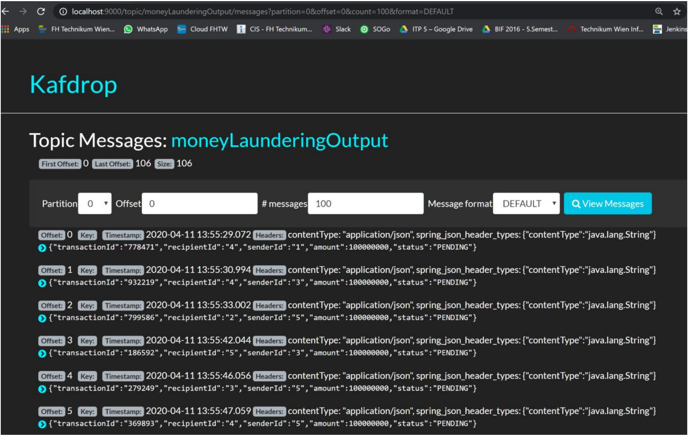

# Spring Cloud Stream with Kafka
The demo was implemented with the help of Spring Cloud Stream, a framework based on
Spring Boot to create message-driven microservices.

The required infrastructure is provided using Docker containers consisting of images for Kafka, 
Zookeeper and Kafdrop. To start these, only the server.sh file needs to be executed in the RootFolder, which runs docker containers for the infrastructure.

The repository consists of four microservices, each of which is an independent Spring Boot 
applications:

## Core banking service: 
Serves as the source, which is stored under the topics "customerOutput" and 
"transactionOutput" customer and transaction event messages. 

## Customer Service: 
Receives and processes messages under the "customerOutput" topic.

## Money laundering service: 
Receives and processes messages under the "transactionOutput" Topic. If a certain amount is exceeded, it creates the transaction event messages under the "moneyLaunderingOutput" topic.

## Balance service
Receives and processes messages under the "transactionOutput" and "moneyLaunderingOutput" topics. 
the "moneyLaunderingOutput" topic. Transactions that are received under the "transactionOutput" topic 
are marked as approved. Transactions in the other topic receive the status money-laundering-risk.

The messages (transaction and customer objects) are transmitted in JSON format.
The topic messages can also be displayed using the KafDrop tool on port 9000
